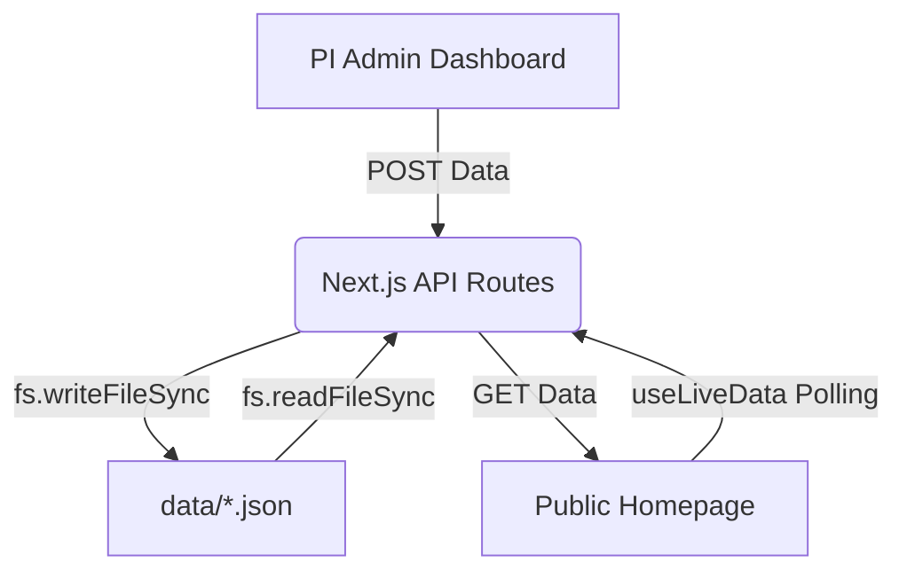

# 🏗️ Herbal Omics Lab: System Architecture

This document outlines the technical architecture, data flow, and component hierarchy of the Herbal Omics Lab platform.

---

## 🛰️ 1. Data Flow Diagram

The platform operates on a **Tri-Layer Architecture**:

1.  **Admin Layer** (Dashboard):
    - Reactive UI built with React state.
    - Sends `POST` requests with state payload to the API.
2.  **Service Layer** (Next.js API Routes):
    - Receives data.
    - Uses Node.js `fs` to write to `data/*.json`.
3.  **Client Layer** (Public Website):
    - Custom `useLiveData` hook polls the API.
    - Hydrates the frontend with the latest JSON content.

---

## 📂 2. File System Logic

### The "App" Directory (Next.js 16)
Next.js 16 uses the **App Router** to handle both pages and backend endpoints.

- **`src/app/page.tsx`**: The main arrival point. It aggregates all sections (Hero, Team, Facilities) into a single cohesive experience.
- **`src/app/admin/page.tsx`**: A protected Single Page Application (SPA). It uses a "Tabbed Interface" state-driven layout.
- **`src/app/api/`**: The backend of our frontend. Each subdirectory reflects a "Resource" (e.g., `/api/admin-data` handles all JSON-backed tables).

### Components & Styling
- **CSS Modules**: We chose CSS Modules (`*.module.css`) to prevent "style leaking." Each component owns its styling, ensuring that changing the Hero section doesn't affect the Footer.
- **Framer Motion**: Integrated to handle entrance animations and interaction feedback (hover effects, card expansions).

---

## 🔐 3. Authentication & Security Sequence

The security is built directly into the React component lifecycle:

1.  **Request**: User attempts to access `/admin`.
2.  **Mount**: `AdminDashboard` component mounts.
3.  **Check**: `useEffect` fires to check `sessionStorage` for `isAdminAuthenticated`.
4.  **Action**:
    - **Success**: State `isAuthorized` becomes `true` -> Dashboard renders.
    - **Failure**: `router.push("/")` is called immediately -> User is evicted.

---

## 🧪 4. Tech Choice Rationale

| Technology | Role | Rationale |
| :--- | :--- | :--- |
| **Next.js 16** | Framework | Best-in-class performance and built-in API routing. |
| **JSON Flat-Files** | Database | Zero-cost hosting, ultra-fast reads, and local portability. |
| **sessionStorage** | Auth | Simple, lightweight, and automatically clears when the tab is closed. |
| **Lucide React** | Icons | SVG-based, lightweight, and highly customizable for scientific UIs. |

---

## 🛠️ 5. Maintenance & Scaling
To add a new feature (e.g., a "Blog" section):
1.  Add a `blog.json` to the `data/` directory.
2.  Update `/api/admin-data` to handle the `blog` type.
3.  Add a **BlogTab** to the Admin Dashboard.
4.  Create a **BlogSection** for the main homepage.
