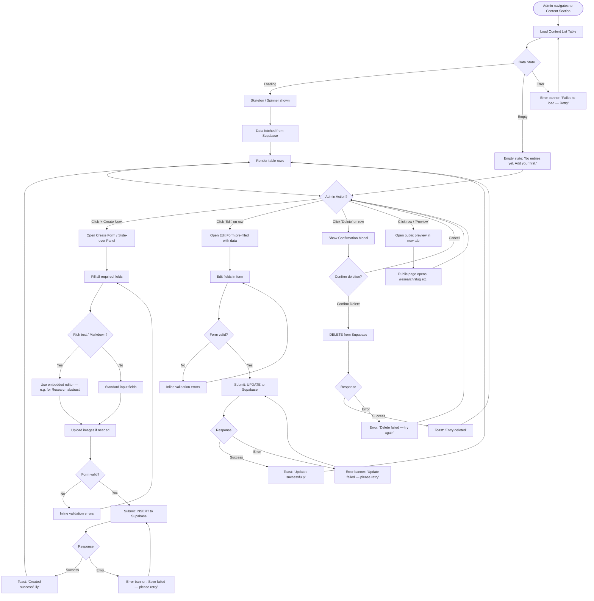
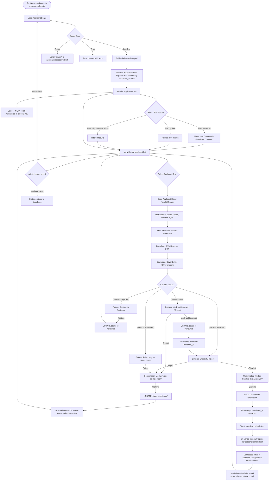
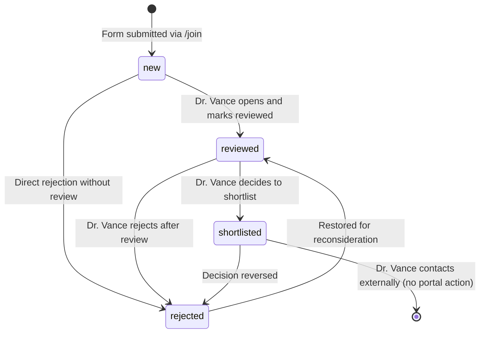
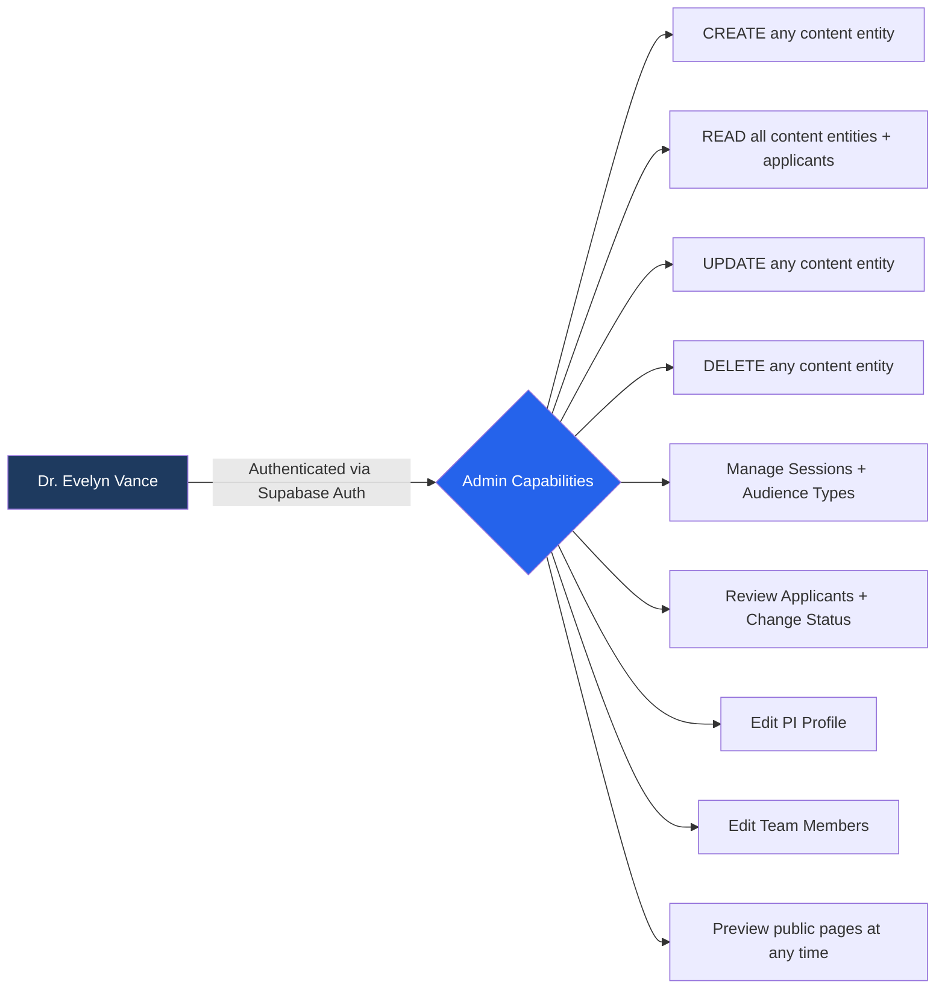
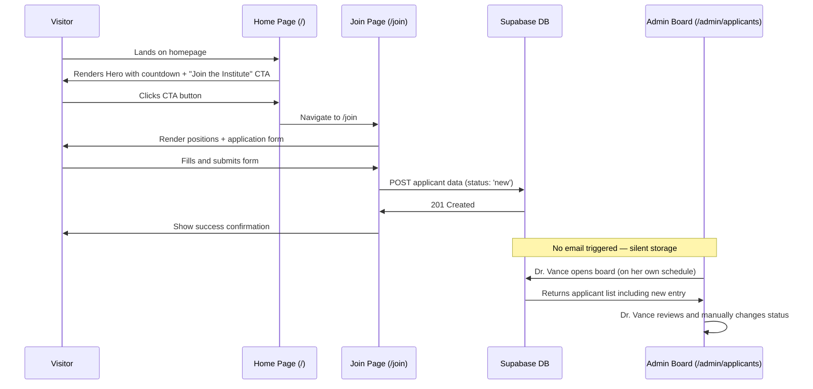
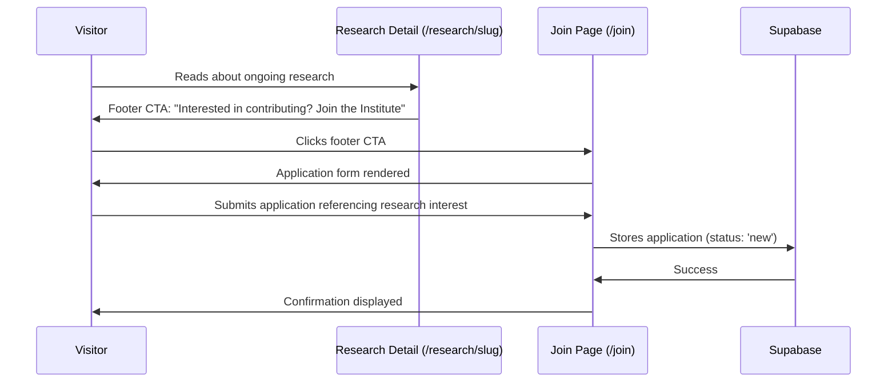
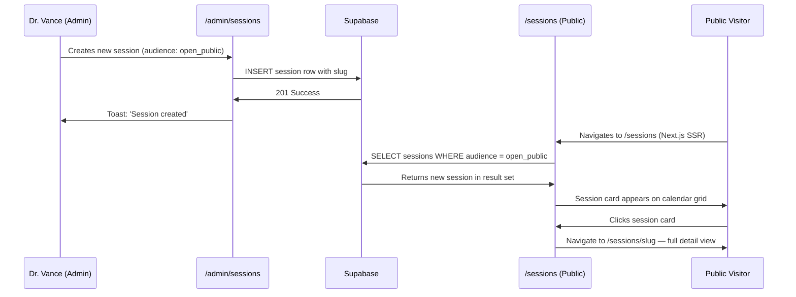
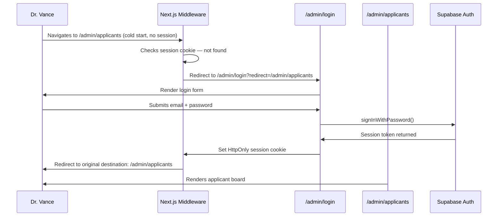

# Nexus Genomics Institute — Digital Portal
## App Flow Document

**Version:** 1.0  
**Date:** May 26, 2026  
**Project:** Nexus Genomics Institute Digital Portal (First Release)  
**Tech Stack:** Next.js 15 App Router · TypeScript · Supabase · Vercel  
**Author:** Antigravity AI — Project Architecture Division  

---

## Table of Contents

1. [Overview](#1-overview)
2. [User Personas](#2-user-personas)
3. [Sitemap & Navigation Tree](#3-sitemap--navigation-tree)
4. [User Flow Diagrams](#4-user-flow-diagrams)
   - 4.1 [Public Visitor — Complete Navigation Flow](#41-public-visitor--complete-navigation-flow)
   - 4.2 [Prospective Scholar — Application Flow](#42-prospective-scholar--application-flow)
   - 4.3 [Admin — Authentication & Dashboard Flow](#43-admin--authentication--dashboard-flow)
   - 4.4 [Admin — Content Management (CRUD) Flow](#44-admin--content-management-crud-flow)
   - 4.5 [Admin — Applicant Review Flow](#45-admin--applicant-review-flow)
   - 4.6 [Sessions Calendar — Creation & Public Display Flow](#46-sessions-calendar--creation--public-display-flow)
5. [Page-by-Page Entry & Exit Points](#5-page-by-page-entry--exit-points)
6. [State Transitions](#6-state-transitions)
7. [Admin Permission Model](#7-admin-permission-model)
8. [Cross-Flow Interactions](#8-cross-flow-interactions)
9. [SEO & Schema Strategy](#9-seo--schema-strategy)

---

## 1. Overview

The Nexus Genomics Institute Digital Portal is the institute's **first-ever public-facing website**, built from scratch to serve two distinct audiences: general public visitors (researchers, prospective scholars, collaborators, and press) and a single privileged administrator — **Dr. Evelyn Vance**, the Principal Investigator (PI).

The portal presents the institute's research portfolio, facilities, strategic goals, event sessions, and career opportunities. The admin area enables Dr. Vance to manage all content dynamically through a protected dashboard, review incoming applications, and maintain the institute's public image without relying on third-party CMS tools.

### High-Level Architecture

```
                  ┌─────────────────────────────────────┐
                  │         Nexus Genomics Portal        │
                  │   (Next.js 15 App Router · Vercel)   │
                  └──────────────┬──────────────────────┘
                                 │
              ┌──────────────────┴──────────────────┐
              │                                     │
    ┌─────────▼──────────┐              ┌───────────▼──────────┐
    │   Public Routes     │              │    Admin Routes       │
    │  (No auth required) │              │  (Auth-gated, SSR)   │
    └─────────────────────┘              └──────────────────────┘
              │                                     │
    ┌─────────▼──────────┐              ┌───────────▼──────────┐
    │   Supabase (DB)     │◄────────────│  Supabase Auth +      │
    │   Public Read       │             │  RLS Policies (Write) │
    └─────────────────────┘             └──────────────────────┘
```

---

## 2. User Personas

### 2.1 Public Visitor

| Attribute | Detail |
|-----------|--------|
| **Identity** | Anonymous (no login required) |
| **Types** | General public · Prospective scholars · External collaborators · Press |
| **Goal** | Explore research, learn about the institute, attend sessions, apply for positions |
| **Access** | All public routes (`/`, `/research`, `/facilities`, `/goals`, `/sessions`, `/join`, `/about`) |
| **Limitations** | Cannot access admin area; cannot modify any content |

### 2.2 Admin — Dr. Evelyn Vance

| Attribute | Detail |
|-----------|--------|
| **Identity** | Authenticated (Supabase Auth, email + password) |
| **Role** | Principal Investigator; sole administrator |
| **Goal** | Manage all portal content, review applicants, maintain sessions calendar, update PI profile |
| **Access** | All admin routes (`/admin/*`) + full read access to all public content |
| **Special Behavior** | Applicants do NOT auto-email Dr. Vance; she reviews a board and contacts shortlisted candidates personally |

---

## 3. Sitemap & Navigation Tree

```
nexusgenomics.org/
│
├── /                          → Home (Hero, Countdown, Featured Research, CTA)
│
├── /research                  → Research Index (all publications/projects)
│   └── /research/[slug]       → Individual Research Detail Page
│
├── /facilities                → Facilities Index (lab equipment, spaces)
│   └── /facilities/[slug]     → Individual Facility Detail Page
│
├── /goals                     → Strategic Goals (vertical timeline view)
│   └── /goals/[slug]          → Individual Goal Detail Page
│
├── /sessions                  → Sessions Calendar (filtered by audience type)
│   └── /sessions/[slug]       → Individual Session Detail Page
│
├── /join                      → Join / Careers Page (application form)
│
├── /about                     → About the Institute + Team
│
└── /admin                     → Admin Area (auth-gated)
    ├── /admin/login            → Login Page (redirect if already authenticated)
    ├── /admin (dashboard)      → Overview stats, quick links
    ├── /admin/research         → Manage Research entries (CRUD)
    ├── /admin/facilities       → Manage Facilities entries (CRUD)
    ├── /admin/goals            → Manage Goals entries (CRUD)
    ├── /admin/sessions         → Manage Sessions + Calendar entries (CRUD)
    ├── /admin/team             → Manage Team Members (CRUD)
    ├── /admin/applicants       → Applicant Review Board (status management)
    └── /admin/pi               → Edit PI Profile (Dr. Vance's own bio/photo)
```

### Primary Navigation (Public Header)

| Label | Route | Notes |
|-------|-------|-------|
| Home | `/` | Logo click |
| Research | `/research` | Dropdown optional |
| Facilities | `/facilities` | |
| Goals | `/goals` | |
| Sessions | `/sessions` | |
| About | `/about` | |
| Join Us | `/join` | CTA button style |

### Admin Sidebar Navigation

| Label | Route |
|-------|-------|
| Dashboard | `/admin` |
| Research | `/admin/research` |
| Facilities | `/admin/facilities` |
| Goals | `/admin/goals` |
| Sessions | `/admin/sessions` |
| Team | `/admin/team` |
| Applicants | `/admin/applicants` |
| PI Profile | `/admin/pi` |
| Sign Out | — (action) |

---

## 4. User Flow Diagrams

### 4.1 Public Visitor — Complete Navigation Flow

```mermaid
flowchart TD
    A([User Arrives at Portal]) --> B{Entry Point?}

    B -->|Direct URL / Search| C[/ — Home Page]
    B -->|Social / External Link| D{Destination Page}
    B -->|Bookmark| D

    D -->|/research/slug| R2[Research Detail]
    D -->|/sessions/slug| S2[Session Detail]
    D -->|/facilities/slug| F2[Facility Detail]
    D -->|/goals/slug| G2[Goal Detail]
    D -->|/join| J[Join Page]
    D -->|/about| AB[About Page]

    C --> C1[View Hero Section + Countdown Timer]
    C1 --> C2[View Featured Research Cards]
    C2 --> C3{CTA Interaction?}

    C3 -->|Click 'View All Research'| R[/research — Research Index]
    C3 -->|Click 'Join the Institute'| J
    C3 -->|Click 'View Sessions'| S[/sessions — Sessions Calendar]
    C3 -->|Explore Facilities| F[/facilities — Facilities Index]
    C3 -->|Explore Goals| G[/goals — Goals Timeline]
    C3 -->|No action - scroll| C4[View About Teaser Section]
    C4 --> C5{Footer Navigation}

    R --> R1[Browse Research Cards + Filter]
    R1 --> R2[Research Detail — /research/slug]
    R2 --> R2a[Read Abstract / Methods / Outcomes]
    R2a --> R2b{Next Action?}
    R2b -->|Back| R1
    R2b -->|Related Research link| R2
    R2b -->|Footer CTA| J

    F --> F1[Browse Facility Cards]
    F1 --> F2[Facility Detail — /facilities/slug]
    F2 --> F2a[View Equipment / Specs / Images]
    F2a --> F2b{Next Action?}
    F2b -->|Back| F1
    F2b -->|Footer Nav| C

    G --> G1[View Vertical Goal Timeline]
    G1 --> G2[Goal Detail — /goals/slug]
    G2 --> G2a[Read Milestone Progress & Description]
    G2a --> G2b{Next Action?}
    G2b -->|Back| G1
    G2b -->|Related Goal| G2

    S --> S1[View Sessions Calendar Grid]
    S1 --> S2a{Filter by Audience Type}
    S2a -->|Internal Only| S3[Show Internal Sessions]
    S2a -->|Collaborators| S4[Show Collaborator Sessions]
    S2a -->|Open Public| S5[Show All-Public Sessions]
    S2a -->|No filter| S6[Show All Accessible Sessions]

    S3 --> S2[Session Detail — /sessions/slug]
    S4 --> S2
    S5 --> S2
    S6 --> S2

    S2 --> S2c[View Date, Speaker, Location, Description]
    S2c --> S2d{Next Action?}
    S2d -->|Back to Calendar| S
    S2d -->|Join Us CTA| J

    J --> J1[View Open Positions / Lab Info]
    J1 --> J2[Fill Application Form]
    J2 --> J3{Form Validation}
    J3 -->|Invalid| J2
    J3 -->|Valid| J4[Submit Application]
    J4 --> J5[Success Confirmation Screen]
    J5 --> J6{Next Action?}
    J6 -->|Return Home| C
    J6 -->|Explore Research| R

    AB --> AB1[Read Institute History & Mission]
    AB1 --> AB2[View Team Member Cards]
    AB2 --> AB3{Next Action?}
    AB3 -->|View Research| R
    AB3 -->|Join CTA| J
    AB3 -->|Home| C

    C5 -->|Footer Links| R
    C5 -->|Footer Links| F
    C5 -->|Footer Links| G
    C5 -->|Footer Links| S
    C5 -->|Footer Links| AB
    C5 -->|Footer Links| J
```

---

### 4.2 Prospective Scholar — Application Flow

```mermaid
flowchart TD
    A([Prospective Scholar]) --> B{Discovery Path}

    B -->|Organic Search| C[/ — Home Page]
    B -->|Direct to /join| J[Join Page]
    B -->|Research page CTA| R[Research Detail Page]
    B -->|About page CTA| AB[About Page]

    C --> C1[Read Hero: 'Join Our Lab' CTA Banner]
    C1 --> C2{Clicks CTA?}
    C2 -->|Yes| J
    C2 -->|No, scrolls| C3[View Institute Highlights]
    C3 --> C4[Footer Join CTA] --> J

    R --> R1[Read Research — Inspired to Apply]
    R1 --> J

    AB --> AB1[Read Team + Mission] --> J

    J --> J1[Read Positions & Requirements]
    J1 --> J2[View Lab Culture / Benefits Section]
    J2 --> J3[Locate Application Form]
    J3 --> J4[Fill: Full Name]
    J4 --> J5[Fill: Email Address]
    J5 --> J6[Fill: Phone Number optional]
    J6 --> J7[Select Position Type]
    J7 --> J8[Fill: Research Interests Statement]
    J8 --> J9[Upload CV / Resume]
    J9 --> J10[Upload Cover Letter optional]
    J10 --> J11{Client-Side Validation}

    J11 -->|Missing required fields| J12[Inline Field Errors Displayed]
    J12 --> J4

    J11 -->|All valid| J13[Submit Button Active]
    J13 --> J14[POST to Supabase via Server Action]
    J14 --> J15{Server Response}

    J15 -->|Success| J16[Success Banner: 'Application Received']
    J15 -->|File upload error| J17[Error: File too large or wrong type]
    J15 -->|Network error| J18[Error: Please try again]

    J17 --> J9
    J18 --> J13

    J16 --> J19[Application stored in Supabase — status: 'new']
    J19 --> J20[Admin board updated — Dr. Vance sees new entry]
    J20 --> J21[Scholar waits — NO auto-email sent]

    J21 --> J22{If shortlisted by Dr. Vance}
    J22 -->|Yes| J23[Dr. Vance contacts personally via her email client]
    J22 -->|No action| J24[Application remains in board — no notification]

    J16 --> J25{Scholar's next action}
    J25 -->|Continue exploring| R
    J25 -->|Return Home| C
    J25 -->|Close tab| Z([Exit])
```

---

### 4.3 Admin — Authentication & Dashboard Flow

```mermaid
flowchart TD
    A([Dr. Vance opens browser]) --> B[Navigate to /admin]

    B --> C{Session Cookie Present?}

    C -->|No valid session| D[Redirect to /admin/login]
    C -->|Valid session exists| E[/admin — Dashboard]

    D --> D1[View Login Form]
    D1 --> D2[Enter Email]
    D2 --> D3[Enter Password]
    D3 --> D4[Click Sign In]
    D4 --> D5{Supabase Auth Check}

    D5 -->|Invalid credentials| D6[Error: 'Invalid email or password']
    D6 --> D1

    D5 -->|Rate limited| D7[Error: 'Too many attempts — try later']
    D7 --> D1

    D5 -->|Valid credentials| D8[Session token set — HttpOnly cookie]
    D8 --> E

    E --> E1[View Dashboard Stats]
    E1 --> E2[Total Research Entries]
    E1 --> E3[Active Sessions This Month]
    E1 --> E4[New Applicants count badge]
    E1 --> E5[Pending Goals count]

    E --> E6[Quick Action Buttons]
    E6 -->|+ New Research| R[/admin/research → Create]
    E6 -->|+ New Session| S[/admin/sessions → Create]
    E6 -->|Review Applicants| AP[/admin/applicants]

    E --> E7[Sidebar Navigation]
    E7 -->|Research| R
    E7 -->|Facilities| F[/admin/facilities]
    E7 -->|Goals| G[/admin/goals]
    E7 -->|Sessions| S
    E7 -->|Team| T[/admin/team]
    E7 -->|Applicants| AP
    E7 -->|PI Profile| PI[/admin/pi]

    E --> E8{Sign Out?}
    E8 -->|Click Sign Out| E9[Supabase signOut called]
    E9 --> E10[Session cookie cleared]
    E10 --> D

    E --> E11{Session Expiry?}
    E11 -->|Token expired mid-session| E12[Middleware intercepts next request]
    E12 --> D
```

---

### 4.4 Admin — Content Management (CRUD) Flow

> Applies uniformly to: `/admin/research`, `/admin/facilities`, `/admin/goals`, `/admin/team`, `/admin/pi`



---

### 4.5 Admin — Applicant Review Flow

> **Critical Design Rule:** Applications submitted via `/join` are stored in Supabase only. No automatic email notification is sent to Dr. Vance. She accesses the board on her own schedule and personally contacts only shortlisted candidates via her own email client.



#### Applicant Status State Machine



---

### 4.6 Sessions Calendar — Creation & Public Display Flow

```mermaid
flowchart TD
    subgraph ADMIN ["Admin: Create Session — /admin/sessions"]
        A([Dr. Vance opens /admin/sessions]) --> A1[View Sessions List Table]
        A1 --> A2[Click '+ Create New Session']
        A2 --> A3[Fill: Session Title]
        A3 --> A4[Fill: Date & Time — datetime picker]
        A4 --> A5[Fill: Duration]
        A5 --> A6[Fill: Location / Virtual Link]
        A6 --> A7[Fill: Speaker Name & Bio]
        A7 --> A8[Fill: Description]
        A8 --> A9{Select Audience Type}
        A9 -->|internal| A10[Tag: Internal Team Only]
        A9 -->|collaborators| A11[Tag: Collaborators + Internal]
        A9 -->|open_public| A12[Tag: Open to All]
        A10 --> A13[Submit: INSERT to Supabase]
        A11 --> A13
        A12 --> A13
        A13 --> A14{Save Response}
        A14 -->|Success| A15[Toast: 'Session created']
        A15 --> A16[Session appears in list with slug auto-generated]
        A14 -->|Error| A17[Error banner — retry]
    end

    subgraph PUBLIC ["Public Visitor: View Sessions — /sessions"]
        B([Visitor navigates to /sessions]) --> B1[Calendar Grid loads — SSR]
        B1 --> B2{Data State}
        B2 -->|Loading| B3[Skeleton grid displayed]
        B2 -->|Empty| B4[Empty state: 'No upcoming sessions']
        B2 -->|Loaded| B5[Render sessions on calendar]

        B5 --> B6{Audience Filter UI}
        B6 -->|Default view: open_public only| B7[Calendar shows open_public sessions]
        B6 -->|User toggles filter tab| B8[Tab switcher: All / Internal / Collaborators]

        B7 --> B9[Click session card]
        B8 --> B9
        B9 --> B10[Navigate to /sessions/slug]
        B10 --> B11[View full session detail]
        B11 --> B12[Date / Time / Speaker / Description / Location]
        B12 --> B13{Past or Future?}
        B13 -->|Upcoming| B14[Show 'Add to Calendar' button]
        B13 -->|Past| B15[Show 'This session has ended' banner]
        B14 --> B16{Next Action}
        B16 -->|Back to calendar| B1
        B16 -->|Join Us CTA| J[/join — Application]
        B15 --> B16
    end

    A16 -.->|Supabase DB update triggers SSR refresh| B5
```

---

## 5. Page-by-Page Entry & Exit Points

### Public Pages

| Page | Entry Points | Exit Points |
|------|-------------|-------------|
| `/` Home | Direct URL, Google search, social links, all footer links | `/research`, `/facilities`, `/goals`, `/sessions`, `/join`, `/about` |
| `/research` | Header nav, home CTA, footer, back from detail | `/research/[slug]`, `/join`, `/` |
| `/research/[slug]` | Research index card click, direct URL, external citation link | `/research` (back), related research links, `/join` (footer CTA) |
| `/facilities` | Header nav, footer, home section | `/facilities/[slug]`, `/` |
| `/facilities/[slug]` | Facility card click, direct URL | `/facilities` (back), `/` |
| `/goals` | Header nav, footer | `/goals/[slug]`, `/` |
| `/goals/[slug]` | Goal card / timeline click, direct URL | `/goals` (back), related goal links |
| `/sessions` | Header nav, home CTA, footer | `/sessions/[slug]`, `/join` |
| `/sessions/[slug]` | Calendar card click, direct URL | `/sessions` (back), `/join` |
| `/join` | Header CTA button, home banner CTA, research footer CTA, about CTA | Success state → `/`, `/research` |
| `/about` | Header nav, footer | `/research`, `/join`, `/` |

### Admin Pages

| Page | Entry Points | Exit Points |
|------|-------------|-------------|
| `/admin/login` | Direct URL, middleware redirect from any `/admin/*` route | `/admin` dashboard (on success) |
| `/admin` (dashboard) | Post-login redirect, sidebar logo click | All `/admin/*` sub-pages |
| `/admin/research` | Sidebar nav, dashboard quick link | `/admin` (breadcrumb), public preview `/research/slug` |
| `/admin/facilities` | Sidebar nav | `/admin`, public preview `/facilities/slug` |
| `/admin/goals` | Sidebar nav | `/admin`, public preview `/goals/slug` |
| `/admin/sessions` | Sidebar nav, dashboard quick link | `/admin`, public preview `/sessions/slug` |
| `/admin/team` | Sidebar nav | `/admin` |
| `/admin/applicants` | Sidebar nav, dashboard badge click | `/admin` |
| `/admin/pi` | Sidebar nav | `/admin`, public preview on `/about` |

---

## 6. State Transitions

### 6.1 Loading States

| Context | Behavior |
|---------|----------|
| Public list pages (RSC) | Server-side rendered; Next.js `loading.tsx` suspense skeleton shown during navigation transitions |
| Admin tables | Client-side fetch with skeleton table rows (ghost rows) |
| Form submission | Submit button shows spinner; all inputs disabled to prevent double submit |
| Sessions calendar grid | Month skeleton with ghost session cards in grid cells |
| Individual detail pages | RSC with `generateStaticParams` for known slugs; fallback: streaming skeleton |

### 6.2 Empty States

| Page / Context | Empty State Message |
|----------------|---------------------|
| `/research` | "No research entries yet. Check back soon." |
| `/facilities` | "Facilities are being catalogued. Coming soon." |
| `/goals` | "Strategic goals are being documented." |
| `/sessions` | "No upcoming sessions scheduled." |
| `/join` | N/A — form is always shown |
| `/admin/applicants` | "No applications have been received yet." |
| Admin CRUD tables | "No entries found. Add your first [entity]." |

### 6.3 Error States

| Trigger | User-Facing Response |
|---------|---------------------|
| Supabase fetch failure (public) | Inline error banner with retry button |
| Form submit failure | Toast: "Something went wrong. Please try again." |
| Admin login failure | Inline field error below password input |
| 404 — invalid slug | Custom `/not-found.tsx` page with back navigation |
| Middleware auth rejection | Redirect to `/admin/login?redirect=[original-path]` |
| File upload too large | Inline file input error: "File must be under X MB" |
| File upload wrong format | Inline error: "Only PDF files are accepted" |

### 6.4 Success States

| Action | Feedback |
|--------|----------|
| Application submitted | Full-page confirmation: "Your application has been received. We'll be in touch if shortlisted." |
| Admin: content created | Toast notification (3s auto-dismiss): "Created successfully" |
| Admin: content updated | Toast notification: "Updated successfully" |
| Admin: content deleted | Toast notification: "Deleted" + row removed from table |
| Admin: applicant status changed | Inline status badge update + toast confirmation |
| Admin: PI profile saved | Toast: "Profile updated" |

---

## 7. Admin Permission Model

Dr. Vance is the **sole administrator** of the portal. The permission model is intentionally flat and maximally permissive within the `/admin/*` scope.



### Supabase RLS Policy Summary

| Table | Public (anon) | Admin (authenticated) |
|-------|--------------|----------------------|
| `research` | SELECT only | SELECT, INSERT, UPDATE, DELETE |
| `facilities` | SELECT only | SELECT, INSERT, UPDATE, DELETE |
| `goals` | SELECT only | SELECT, INSERT, UPDATE, DELETE |
| `sessions` | SELECT (filtered: `audience = open_public`) | SELECT, INSERT, UPDATE, DELETE (all audience types) |
| `team_members` | SELECT only | SELECT, INSERT, UPDATE, DELETE |
| `applicants` | INSERT only (form submission) | SELECT, UPDATE (`status` field only for audit safety) |
| `pi_profile` | SELECT only | SELECT, UPDATE |

> [!IMPORTANT]
> The `applicants` table grants anonymous users INSERT-only access. No `DELETE` is exposed to the admin either, preserving a complete audit trail of all submissions. Status changes are the only mutation the admin performs.

---

## 8. Cross-Flow Interactions

### 8.1 Homepage CTA → Application Flow



### 8.2 Research Detail → Inspiration → Application



### 8.3 Session Created → Public Calendar Updated



### 8.4 Admin Login Redirect Chain



---

## 9. SEO & Schema Strategy

All public pages implement server-side rendered SEO metadata and structured data via Next.js `generateMetadata()` and embedded JSON-LD `<script>` tags.

| Page | Title Pattern | Schema Type |
|------|--------------|-------------|
| `/` | "Nexus Genomics Institute — Advancing Genomic Science" | `Organization`, `WebSite` |
| `/research` | "Research — Nexus Genomics Institute" | `CollectionPage` |
| `/research/[slug]` | `[Research Title] — Nexus Genomics Institute` | `ScholarlyArticle` / `ResearchProject` |
| `/facilities` | "Facilities — Nexus Genomics Institute" | `CollectionPage` |
| `/facilities/[slug]` | `[Facility Name] — Nexus Genomics Institute` | `Place` |
| `/goals` | "Strategic Goals — Nexus Genomics Institute" | `CollectionPage` |
| `/goals/[slug]` | `[Goal Title] — Nexus Genomics Institute` | `Goal` |
| `/sessions` | "Sessions & Events — Nexus Genomics Institute" | `EventSeries` |
| `/sessions/[slug]` | `[Session Title] — Nexus Genomics Institute` | `Event` |
| `/join` | "Join the Lab — Nexus Genomics Institute" | `JobPosting` |
| `/about` | "About — Nexus Genomics Institute" | `AboutPage`, `Person` (PI) |

### Canonical, OG & Robots Tags

- All pages include `<link rel="canonical">` with absolute URL
- Open Graph (`og:title`, `og:description`, `og:image`, `og:type`) on all public pages
- Twitter Card meta tags for social sharing (summary_large_image)
- `robots` meta: `index, follow` on all public pages
- `robots` meta: `noindex, nofollow` on all `/admin/*` routes — never indexed

---

*Document ends. Version 1.0 — May 26, 2026.*  
*Nexus Genomics Institute · Confidential Project Documentation*
