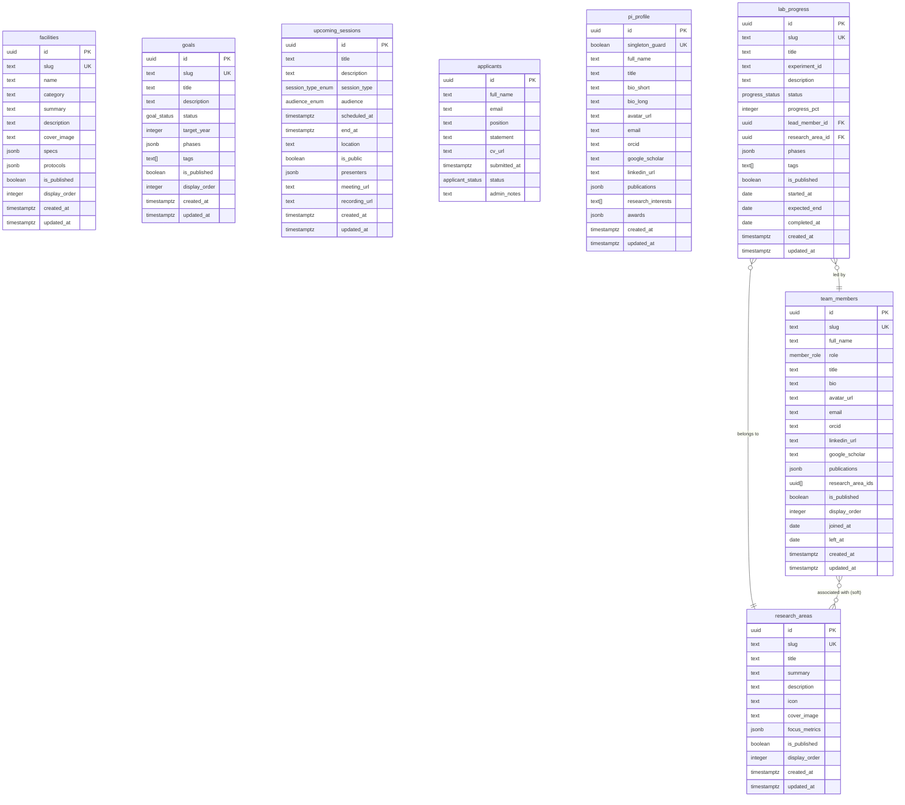

# Nexus Genomics Institute — Backend Schema Reference

> **Document Version:** 1.0.0
> **Last Updated:** 2026-05-26
> **Stack:** Next.js 15 (App Router) · TypeScript · Supabase (PostgreSQL 15 + Storage + Auth) · Vercel
> **Author / Admin:** Dr. Evelyn Vance
> **Build Type:** Greenfield — Institute's first digital portal

---

## Table of Contents

1. [Database Overview](#1-database-overview)
2. [Full Table Schemas](#2-full-table-schemas)
3. [Enum Definitions](#3-enum-definitions)
4. [JSONB Field Schemas](#4-jsonb-field-schemas)
5. [Row Level Security (RLS) Policies](#5-row-level-security-rls-policies)
6. [Supabase Storage Buckets](#6-supabase-storage-buckets)
7. [Supabase Auth Configuration](#7-supabase-auth-configuration)
8. [API Route Contracts](#8-api-route-contracts)
9. [Fallback Data Strategy](#9-fallback-data-strategy)
10. [Database Indexes](#10-database-indexes)
11. [Entity Relationship Diagram](#11-entity-relationship-diagram)

---

## 1. Database Overview

Nexus Genomics Institute's portal uses **Supabase** as its backend platform, providing PostgreSQL 15 for structured data, built-in Auth, and object Storage — all hosted on Supabase's managed infrastructure and consumed from Next.js 15 App Router via the `@supabase/ssr` client.

### Database: `postgres` (default Supabase project DB)

| Table | Purpose |
|---|---|
| `research_areas` | Describes the institute's research domains (e.g., CRISPR, single-cell genomics) |
| `facilities` | Describes physical/virtual lab instruments and infrastructure |
| `goals` | Strategic/scientific goals and milestones of the institute |
| `team_members` | Profiles of all institute researchers, staff, and collaborators |
| `upcoming_sessions` | Calendar entries for meetings, symposia, public events, and knowledge exchanges |
| `applicants` | Job/fellowship application submissions from prospective candidates |
| `pi_profile` | Singleton row containing Dr. Evelyn Vance's principal investigator profile |
| `lab_progress` | Active experiment and project progress tracker cards |

> **Singleton pattern:** `pi_profile` enforces exactly one row via a `CHECK` constraint and a trigger. All other tables are multi-row.

---

## 2. Full Table Schemas

### 2.1 Enums (created before tables — see §3 for full definitions)

```sql
-- Must be created in this order before table DDL
CREATE TYPE session_type_enum AS ENUM ('weekly_meeting', 'symposium', 'knowledge_exchange', 'public_event');
CREATE TYPE audience_enum    AS ENUM ('internal', 'collaborators', 'open_public');
CREATE TYPE applicant_status AS ENUM ('pending', 'reviewing', 'shortlisted', 'rejected', 'hired');
CREATE TYPE member_role      AS ENUM ('pi', 'postdoc', 'phd_student', 'research_scientist', 'lab_manager', 'collaborator', 'alumni');
CREATE TYPE goal_status      AS ENUM ('planned', 'in_progress', 'completed', 'paused');
CREATE TYPE progress_status  AS ENUM ('active', 'on_hold', 'completed', 'archived');
```

---

### 2.2 `research_areas`

Stores research domain cards shown on the public-facing website.

```sql
CREATE TABLE public.research_areas (
  id            uuid          PRIMARY KEY DEFAULT gen_random_uuid(),
  slug          text          NOT NULL UNIQUE,
  title         text          NOT NULL,
  summary       text          NOT NULL,
  description   text,                                    -- long-form markdown body
  icon          text,                                    -- icon name or SVG path key
  cover_image   text,                                    -- Supabase Storage path
  focus_metrics jsonb         NOT NULL DEFAULT '[]'::jsonb,
  is_published  boolean       NOT NULL DEFAULT false,
  display_order integer       NOT NULL DEFAULT 0,
  created_at    timestamptz   NOT NULL DEFAULT now(),
  updated_at    timestamptz   NOT NULL DEFAULT now()
);

COMMENT ON TABLE  public.research_areas                IS 'Research domain cards for the public portal';
COMMENT ON COLUMN public.research_areas.slug           IS 'URL-safe unique identifier, e.g. crispr-gene-editing';
COMMENT ON COLUMN public.research_areas.focus_metrics  IS 'Array of FocusMetric objects — see §4.1';
COMMENT ON COLUMN public.research_areas.is_published   IS 'Only published rows appear on public site';
COMMENT ON COLUMN public.research_areas.display_order  IS 'Ascending sort order for rendering on site';
```

---

### 2.3 `facilities`

Describes laboratory instruments, shared equipment, and virtual/computational resources.

```sql
CREATE TABLE public.facilities (
  id            uuid          PRIMARY KEY DEFAULT gen_random_uuid(),
  slug          text          NOT NULL UNIQUE,
  name          text          NOT NULL,
  category      text          NOT NULL,                 -- e.g. "Sequencing", "Imaging", "Compute"
  summary       text          NOT NULL,
  description   text,                                   -- long-form markdown
  cover_image   text,                                   -- Supabase Storage path
  specs         jsonb         NOT NULL DEFAULT '{}'::jsonb,
  protocols     jsonb         NOT NULL DEFAULT '[]'::jsonb,
  is_published  boolean       NOT NULL DEFAULT false,
  display_order integer       NOT NULL DEFAULT 0,
  created_at    timestamptz   NOT NULL DEFAULT now(),
  updated_at    timestamptz   NOT NULL DEFAULT now()
);

COMMENT ON TABLE  public.facilities            IS 'Lab instruments, equipment, and compute resources';
COMMENT ON COLUMN public.facilities.specs      IS 'EquipmentSpec object — see §4.2';
COMMENT ON COLUMN public.facilities.protocols  IS 'Array of ProtocolEntry objects — see §4.3';
```

---

### 2.4 `goals`

Strategic and scientific goals of the institute, used for a public-facing roadmap section.

```sql
CREATE TABLE public.goals (
  id            uuid          PRIMARY KEY DEFAULT gen_random_uuid(),
  slug          text          NOT NULL UNIQUE,
  title         text          NOT NULL,
  description   text          NOT NULL,
  status        goal_status   NOT NULL DEFAULT 'planned',
  target_year   integer,                                -- NULL = open-ended
  phases        jsonb         NOT NULL DEFAULT '[]'::jsonb,
  tags          text[]        NOT NULL DEFAULT '{}',
  is_published  boolean       NOT NULL DEFAULT false,
  display_order integer       NOT NULL DEFAULT 0,
  created_at    timestamptz   NOT NULL DEFAULT now(),
  updated_at    timestamptz   NOT NULL DEFAULT now()
);

COMMENT ON TABLE  public.goals           IS 'Strategic goals and milestones of the institute';
COMMENT ON COLUMN public.goals.phases    IS 'Array of GoalPhase objects — see §4.4';
COMMENT ON COLUMN public.goals.tags      IS 'Free-form tag array for filtering (e.g. ["genomics","ai"])';
```

---

### 2.5 `team_members`

Profiles for all researchers, staff, and collaborators.

```sql
CREATE TABLE public.team_members (
  id              uuid          PRIMARY KEY DEFAULT gen_random_uuid(),
  slug            text          NOT NULL UNIQUE,
  full_name       text          NOT NULL,
  role            member_role   NOT NULL,
  title           text,                                  -- Academic/professional title
  bio             text,                                  -- Markdown bio
  avatar_url      text,                                  -- Supabase Storage path
  email           text,
  orcid           text,                                  -- ORCID iD (0000-0000-0000-0000)
  linkedin_url    text,
  google_scholar  text,                                  -- Google Scholar profile URL
  publications    jsonb         NOT NULL DEFAULT '[]'::jsonb,
  research_area_ids uuid[]      NOT NULL DEFAULT '{}',   -- FK references research_areas.id (soft)
  is_published    boolean       NOT NULL DEFAULT false,
  display_order   integer       NOT NULL DEFAULT 0,
  joined_at       date,
  left_at         date,                                  -- NULL = currently active
  created_at      timestamptz   NOT NULL DEFAULT now(),
  updated_at      timestamptz   NOT NULL DEFAULT now()
);

COMMENT ON TABLE  public.team_members                   IS 'All institute researchers and staff';
COMMENT ON COLUMN public.team_members.publications      IS 'Array of Publication objects — see §4.6';
COMMENT ON COLUMN public.team_members.research_area_ids IS 'Denormalized soft FK array; no CASCADE constraint';
COMMENT ON COLUMN public.team_members.left_at           IS 'NULL means member is currently active (alumni if set)';
```

---

### 2.6 `upcoming_sessions`

Calendar entries for all institute events. Powers both a public calendar and an internal schedule.

```sql
CREATE TABLE public.upcoming_sessions (
  id            uuid              PRIMARY KEY DEFAULT gen_random_uuid(),
  title         text              NOT NULL,
  description   text,                                      -- Full event description (markdown)
  session_type  session_type_enum NOT NULL,
  audience      audience_enum     NOT NULL DEFAULT 'internal',
  scheduled_at  timestamptz       NOT NULL,
  end_at        timestamptz,                               -- NULL = open-ended / TBD
  location      text,                                      -- Physical address or "Virtual" or Zoom link
  is_public     boolean           NOT NULL DEFAULT false,  -- Controls public site visibility
  presenters    jsonb             NOT NULL DEFAULT '[]'::jsonb,
  meeting_url   text,                                      -- Zoom/Teams/Meet link
  recording_url text,                                      -- Post-event recording link
  created_at    timestamptz       NOT NULL DEFAULT now(),
  updated_at    timestamptz       NOT NULL DEFAULT now(),

  CONSTRAINT chk_end_after_start CHECK (end_at IS NULL OR end_at > scheduled_at)
);

COMMENT ON TABLE  public.upcoming_sessions               IS 'Calendar entries: meetings, symposia, public events';
COMMENT ON COLUMN public.upcoming_sessions.session_type  IS 'weekly_meeting | symposium | knowledge_exchange | public_event';
COMMENT ON COLUMN public.upcoming_sessions.audience      IS 'internal | collaborators | open_public';
COMMENT ON COLUMN public.upcoming_sessions.is_public     IS 'true = visible on public website calendar';
COMMENT ON COLUMN public.upcoming_sessions.presenters    IS 'Array of PresenterEntry objects — see §4.5';
```

---

### 2.7 `applicants`

Stores all job/fellowship application submissions. Dr. Vance reviews submissions and contacts shortlisted candidates directly from her personal email — **no automated email is sent on submission**.

```sql
CREATE TABLE public.applicants (
  id            uuid              PRIMARY KEY DEFAULT gen_random_uuid(),
  full_name     text              NOT NULL,
  email         text              NOT NULL,
  position      text              NOT NULL,              -- Role applied for
  statement     text              NOT NULL,              -- Personal/research statement
  cv_url        text,                                    -- Supabase Storage path to uploaded CV
  submitted_at  timestamptz       NOT NULL DEFAULT now(),
  status        applicant_status  NOT NULL DEFAULT 'pending',
  admin_notes   text,                                    -- Private notes by Dr. Vance (never shown publicly)

  CONSTRAINT chk_email_format CHECK (email ~* '^[A-Za-z0-9._%+\-]+@[A-Za-z0-9.\-]+\.[A-Za-z]{2,}$')
);

COMMENT ON TABLE  public.applicants               IS 'Application submissions — no automated emails sent';
COMMENT ON COLUMN public.applicants.cv_url        IS 'Path in Supabase Storage bucket applicant-cvs/';
COMMENT ON COLUMN public.applicants.status        IS 'pending | reviewing | shortlisted | rejected | hired';
COMMENT ON COLUMN public.applicants.admin_notes   IS 'Visible only in admin dashboard, never in public API';
```

---

### 2.8 `pi_profile`

Singleton table. Exactly one row represents Dr. Evelyn Vance's principal investigator profile.

```sql
CREATE TABLE public.pi_profile (
  id              uuid          PRIMARY KEY DEFAULT gen_random_uuid(),
  singleton_guard boolean       NOT NULL DEFAULT true UNIQUE,  -- enforces one row
  full_name       text          NOT NULL DEFAULT 'Dr. Evelyn Vance',
  title           text          NOT NULL DEFAULT 'Principal Investigator',
  bio_short       text          NOT NULL,               -- 1–2 sentence hero tagline
  bio_long        text,                                 -- Full markdown biography
  avatar_url      text,                                 -- Supabase Storage path
  email           text,                                 -- Public contact email (optional)
  orcid           text,
  google_scholar  text,
  linkedin_url    text,
  publications    jsonb         NOT NULL DEFAULT '[]'::jsonb,
  research_interests text[],
  awards          jsonb         NOT NULL DEFAULT '[]'::jsonb,
  created_at      timestamptz   NOT NULL DEFAULT now(),
  updated_at      timestamptz   NOT NULL DEFAULT now(),

  CONSTRAINT singleton_only CHECK (singleton_guard = true)
);

COMMENT ON TABLE  public.pi_profile                   IS 'Singleton: Dr. Evelyn Vance PI profile';
COMMENT ON COLUMN public.pi_profile.singleton_guard   IS 'UNIQUE + CHECK on true ensures exactly one row';
COMMENT ON COLUMN public.pi_profile.publications      IS 'Array of Publication objects — see §4.6';
```

---

### 2.9 `lab_progress`

Active experiments and project progress tracker cards displayed on the admin dashboard and optionally on the public site.

```sql
CREATE TABLE public.lab_progress (
  id              uuid            PRIMARY KEY DEFAULT gen_random_uuid(),
  slug            text            NOT NULL UNIQUE,
  title           text            NOT NULL,
  experiment_id   text,                                  -- Internal experiment ID / ELN reference
  description     text,                                  -- Markdown summary
  status          progress_status NOT NULL DEFAULT 'active',
  progress_pct    integer         NOT NULL DEFAULT 0 CHECK (progress_pct BETWEEN 0 AND 100),
  lead_member_id  uuid            REFERENCES public.team_members(id) ON DELETE SET NULL,
  research_area_id uuid           REFERENCES public.research_areas(id) ON DELETE SET NULL,
  phases          jsonb           NOT NULL DEFAULT '[]'::jsonb,
  tags            text[]          NOT NULL DEFAULT '{}',
  is_published    boolean         NOT NULL DEFAULT false,
  started_at      date,
  expected_end    date,
  completed_at    date,
  created_at      timestamptz     NOT NULL DEFAULT now(),
  updated_at      timestamptz     NOT NULL DEFAULT now(),

  CONSTRAINT chk_progress_dates CHECK (expected_end IS NULL OR started_at IS NULL OR expected_end >= started_at)
);

COMMENT ON TABLE  public.lab_progress                  IS 'Active experiment and project progress cards';
COMMENT ON COLUMN public.lab_progress.progress_pct     IS 'Percentage complete: 0–100';
COMMENT ON COLUMN public.lab_progress.phases           IS 'Array of GoalPhase objects — see §4.4';
COMMENT ON COLUMN public.lab_progress.lead_member_id   IS 'FK to team_members; SET NULL on member deletion';
```

---

### 2.10 Automatic `updated_at` Trigger

Apply this trigger to all tables with an `updated_at` column.

```sql
-- Shared trigger function
CREATE OR REPLACE FUNCTION public.set_updated_at()
RETURNS TRIGGER LANGUAGE plpgsql AS $$
BEGIN
  NEW.updated_at = now();
  RETURN NEW;
END;
$$;

-- Apply to all relevant tables
DO $$
DECLARE
  tbl text;
BEGIN
  FOREACH tbl IN ARRAY ARRAY[
    'research_areas', 'facilities', 'goals', 'team_members',
    'upcoming_sessions', 'pi_profile', 'lab_progress'
  ] LOOP
    EXECUTE format(
      'CREATE TRIGGER trg_%s_updated_at
       BEFORE UPDATE ON public.%s
       FOR EACH ROW EXECUTE FUNCTION public.set_updated_at();',
      tbl, tbl
    );
  END LOOP;
END;
$$;
```

---

## 3. Enum Definitions

| Enum Type | Values | Used In |
|---|---|---|
| `session_type_enum` | `weekly_meeting`, `symposium`, `knowledge_exchange`, `public_event` | `upcoming_sessions.session_type` |
| `audience_enum` | `internal`, `collaborators`, `open_public` | `upcoming_sessions.audience` |
| `applicant_status` | `pending`, `reviewing`, `shortlisted`, `rejected`, `hired` | `applicants.status` |
| `member_role` | `pi`, `postdoc`, `phd_student`, `research_scientist`, `lab_manager`, `collaborator`, `alumni` | `team_members.role` |
| `goal_status` | `planned`, `in_progress`, `completed`, `paused` | `goals.status` |
| `progress_status` | `active`, `on_hold`, `completed`, `archived` | `lab_progress.status` |

### Full DDL

```sql
CREATE TYPE public.session_type_enum AS ENUM (
  'weekly_meeting',
  'symposium',
  'knowledge_exchange',
  'public_event'
);

CREATE TYPE public.audience_enum AS ENUM (
  'internal',
  'collaborators',
  'open_public'
);

CREATE TYPE public.applicant_status AS ENUM (
  'pending',
  'reviewing',
  'shortlisted',
  'rejected',
  'hired'
);

CREATE TYPE public.member_role AS ENUM (
  'pi',
  'postdoc',
  'phd_student',
  'research_scientist',
  'lab_manager',
  'collaborator',
  'alumni'
);

CREATE TYPE public.goal_status AS ENUM (
  'planned',
  'in_progress',
  'completed',
  'paused'
);

CREATE TYPE public.progress_status AS ENUM (
  'active',
  'on_hold',
  'completed',
  'archived'
);
```

---

## 4. JSONB Field Schemas

All JSONB columns follow strict TypeScript interface contracts. The app validates inbound data against these shapes using `zod` schemas before any DB write.

---

### 4.1 `focus_metrics` — `research_areas.focus_metrics`

An array of quantitative metrics highlighting a research area's scope.

```typescript
interface FocusMetric {
  label: string;        // e.g. "Publications"
  value: string;        // e.g. "42" or "18 TB"
  unit?: string;        // e.g. "papers", "datasets"
  icon?: string;        // Icon key for UI rendering
}

type FocusMetrics = FocusMetric[];

// Example
[
  { "label": "Publications", "value": "34", "unit": "papers" },
  { "label": "Datasets",     "value": "12", "unit": "TB" },
  { "label": "Grants",       "value": "5",  "unit": "active" }
]
```

---

### 4.2 `specs` — `facilities.specs`

Key-value technical specification map for a facility or instrument.

```typescript
interface EquipmentSpec {
  manufacturer?: string;
  model?: string;
  year_installed?: number;
  throughput?: string;       // e.g. "48 samples/run"
  resolution?: string;       // e.g. "0.3 nm"
  capacity?: string;         // e.g. "96-well plate"
  software?: string;
  location?: string;         // Lab room / building
  access_mode?: "shared" | "restricted" | "open";
  booking_url?: string;
  notes?: string;
  [key: string]: string | number | undefined; // extensible
}

// Example
{
  "manufacturer": "Illumina",
  "model": "NovaSeq X Plus",
  "year_installed": 2024,
  "throughput": "16 TB / run",
  "access_mode": "restricted",
  "location": "Lab B — Room 204"
}
```

---

### 4.3 `protocols` — `facilities.protocols`

An ordered list of standard operating protocols associated with a facility.

```typescript
interface ProtocolEntry {
  id: string;             // UUID or slug
  title: string;
  version: string;        // e.g. "v2.1"
  url?: string;           // Link to SOP PDF in storage
  updated_at?: string;    // ISO date string
  description?: string;
}

type Protocols = ProtocolEntry[];

// Example
[
  {
    "id": "sop-novaseq-001",
    "title": "NovaSeq Library Prep SOP",
    "version": "v3.0",
    "url": "storage://protocols/novaseq-library-prep-v3.pdf",
    "updated_at": "2025-11-01"
  }
]
```

---

### 4.4 `phases` — `goals.phases` & `lab_progress.phases`

An ordered array of discrete milestones or phases within a goal or experiment.

```typescript
interface GoalPhase {
  id: string;                              // UUID or short slug
  title: string;
  description?: string;
  status: "planned" | "in_progress" | "completed" | "paused";
  target_date?: string;                    // ISO date string
  completed_date?: string;                 // ISO date string
  deliverables?: string[];
}

type GoalPhases = GoalPhase[];

// Example
[
  {
    "id": "phase-1",
    "title": "Baseline Sequencing",
    "status": "completed",
    "target_date": "2025-06-30",
    "completed_date": "2025-06-15",
    "deliverables": ["Raw FASTQ files", "QC report"]
  },
  {
    "id": "phase-2",
    "title": "Variant Calling Pipeline",
    "status": "in_progress",
    "target_date": "2025-12-31"
  }
]
```

---

### 4.5 `presenters` — `upcoming_sessions.presenters`

An array of presenter entries for a session. Can reference internal team members or external guests.

```typescript
interface PresenterEntry {
  name: string;
  title?: string;
  affiliation?: string;         // Institution or lab name
  member_id?: string;           // UUID — references team_members.id if internal
  avatar_url?: string;
  bio_short?: string;
  topic?: string;               // Specific sub-topic they are presenting
}

type Presenters = PresenterEntry[];

// Example
[
  {
    "name": "Dr. Evelyn Vance",
    "title": "Principal Investigator",
    "member_id": "a1b2c3d4-...",
    "topic": "CRISPR off-target analysis update"
  },
  {
    "name": "Prof. James Okafor",
    "affiliation": "MIT Broad Institute",
    "topic": "Single-cell atlas keynote"
  }
]
```

---

### 4.6 `publications` — `team_members.publications` & `pi_profile.publications`

An array of academic publication entries.

```typescript
interface Publication {
  title: string;
  authors: string[];            // Ordered author list
  journal?: string;
  year: number;
  doi?: string;                 // e.g. "10.1038/s41586-023-XXXXX"
  pmid?: string;                // PubMed ID
  url?: string;                 // Full-text or journal link
  is_preprint?: boolean;
  abstract?: string;
  keywords?: string[];
  citation_count?: number;      // Optionally cached, not live
}

type Publications = Publication[];

// Example
[
  {
    "title": "High-throughput single-cell transcriptomics reveals...",
    "authors": ["Vance E", "Li R", "Okafor J"],
    "journal": "Nature Genomics",
    "year": 2024,
    "doi": "10.1038/ng.2024.00123",
    "is_preprint": false
  }
]
```

---

## 5. Row Level Security (RLS) Policies

All tables have RLS enabled. The policy model is:

- **Public (anonymous):** `SELECT` only on rows where `is_published = true` (for content tables) or unconditionally (for `applicants` — insert-only from public)
- **Authenticated (Dr. Vance):** Full `SELECT`, `INSERT`, `UPDATE`, `DELETE`
- **`applicants`:** Anonymous users can `INSERT` only; `SELECT`, `UPDATE`, `DELETE` require authentication

```sql
-- Enable RLS on all tables
ALTER TABLE public.research_areas    ENABLE ROW LEVEL SECURITY;
ALTER TABLE public.facilities        ENABLE ROW LEVEL SECURITY;
ALTER TABLE public.goals             ENABLE ROW LEVEL SECURITY;
ALTER TABLE public.team_members      ENABLE ROW LEVEL SECURITY;
ALTER TABLE public.upcoming_sessions ENABLE ROW LEVEL SECURITY;
ALTER TABLE public.applicants        ENABLE ROW LEVEL SECURITY;
ALTER TABLE public.pi_profile        ENABLE ROW LEVEL SECURITY;
ALTER TABLE public.lab_progress      ENABLE ROW LEVEL SECURITY;
```

### 5.1 `research_areas`

```sql
-- Public: read published rows only
CREATE POLICY "public_read_research_areas"
  ON public.research_areas FOR SELECT
  TO anon
  USING (is_published = true);

-- Admin: full access
CREATE POLICY "admin_all_research_areas"
  ON public.research_areas FOR ALL
  TO authenticated
  USING (true)
  WITH CHECK (true);
```

### 5.2 `facilities`

```sql
CREATE POLICY "public_read_facilities"
  ON public.facilities FOR SELECT
  TO anon
  USING (is_published = true);

CREATE POLICY "admin_all_facilities"
  ON public.facilities FOR ALL
  TO authenticated
  USING (true)
  WITH CHECK (true);
```

### 5.3 `goals`

```sql
CREATE POLICY "public_read_goals"
  ON public.goals FOR SELECT
  TO anon
  USING (is_published = true);

CREATE POLICY "admin_all_goals"
  ON public.goals FOR ALL
  TO authenticated
  USING (true)
  WITH CHECK (true);
```

### 5.4 `team_members`

```sql
CREATE POLICY "public_read_team_members"
  ON public.team_members FOR SELECT
  TO anon
  USING (is_published = true);

CREATE POLICY "admin_all_team_members"
  ON public.team_members FOR ALL
  TO authenticated
  USING (true)
  WITH CHECK (true);
```

### 5.5 `upcoming_sessions`

```sql
-- Public: only sessions explicitly marked public
CREATE POLICY "public_read_upcoming_sessions"
  ON public.upcoming_sessions FOR SELECT
  TO anon
  USING (is_public = true);

CREATE POLICY "admin_all_upcoming_sessions"
  ON public.upcoming_sessions FOR ALL
  TO authenticated
  USING (true)
  WITH CHECK (true);
```

### 5.6 `applicants`

```sql
-- Anonymous: insert only (submit application)
CREATE POLICY "anon_insert_applicants"
  ON public.applicants FOR INSERT
  TO anon
  WITH CHECK (true);

-- Admin: full access (view, update status, add notes)
CREATE POLICY "admin_all_applicants"
  ON public.applicants FOR ALL
  TO authenticated
  USING (true)
  WITH CHECK (true);
```

> **Security note:** Anonymous users can **never** read `applicants` rows. There is no `SELECT` policy for `anon` on this table, so RLS blocks all reads from the public.

### 5.7 `pi_profile`

```sql
-- Public: read the singleton row
CREATE POLICY "public_read_pi_profile"
  ON public.pi_profile FOR SELECT
  TO anon
  USING (true);

CREATE POLICY "admin_all_pi_profile"
  ON public.pi_profile FOR ALL
  TO authenticated
  USING (true)
  WITH CHECK (true);
```

### 5.8 `lab_progress`

```sql
CREATE POLICY "public_read_lab_progress"
  ON public.lab_progress FOR SELECT
  TO anon
  USING (is_published = true);

CREATE POLICY "admin_all_lab_progress"
  ON public.lab_progress FOR ALL
  TO authenticated
  USING (true)
  WITH CHECK (true);
```

---

## 6. Supabase Storage Buckets

### 6.1 Bucket Definitions

| Bucket Name | Public? | Max File Size | Allowed MIME Types | Purpose |
|---|---|---|---|---|
| `research-covers` | ✅ Public | 5 MB | `image/jpeg`, `image/png`, `image/webp`, `image/avif` | Cover images for research area cards |
| `facility-covers` | ✅ Public | 5 MB | `image/jpeg`, `image/png`, `image/webp`, `image/avif` | Cover images for facility cards |
| `team-avatars` | ✅ Public | 2 MB | `image/jpeg`, `image/png`, `image/webp` | Team member and PI profile photos |
| `applicant-cvs` | 🔒 Private | 10 MB | `application/pdf` | Uploaded CVs — admin access only |
| `protocols` | 🔒 Private | 20 MB | `application/pdf` | Lab SOP documents — admin access only |
| `assets` | ✅ Public | 10 MB | `image/*`, `video/mp4`, `video/webm` | General site media (logos, hero videos) |

### 6.2 Folder Structure

```
research-covers/
  └── {research_area_id}/cover.{ext}

facility-covers/
  └── {facility_id}/cover.{ext}

team-avatars/
  └── {member_id}/avatar.{ext}
  └── pi/avatar.{ext}

applicant-cvs/
  └── {applicant_id}/cv.pdf

protocols/
  └── {facility_id}/{protocol_id}.pdf

assets/
  ├── logo/
  ├── hero/
  └── misc/
```

### 6.3 Storage RLS Policies

```sql
-- team-avatars: public read
CREATE POLICY "public_read_team_avatars"
  ON storage.objects FOR SELECT
  TO anon
  USING (bucket_id = 'team-avatars');

-- team-avatars: admin write
CREATE POLICY "admin_write_team_avatars"
  ON storage.objects FOR INSERT
  TO authenticated
  WITH CHECK (bucket_id = 'team-avatars');

-- applicant-cvs: anon upload (on form submit)
CREATE POLICY "anon_upload_applicant_cvs"
  ON storage.objects FOR INSERT
  TO anon
  WITH CHECK (
    bucket_id = 'applicant-cvs'
    AND (storage.foldername(name))[1] != ''
  );

-- applicant-cvs: admin read
CREATE POLICY "admin_read_applicant_cvs"
  ON storage.objects FOR SELECT
  TO authenticated
  USING (bucket_id = 'applicant-cvs');

-- protocols: admin only
CREATE POLICY "admin_all_protocols"
  ON storage.objects FOR ALL
  TO authenticated
  USING (bucket_id = 'protocols')
  WITH CHECK (bucket_id = 'protocols');
```

---

## 7. Supabase Auth Configuration

### 7.1 Strategy

| Setting | Value |
|---|---|
| Auth provider | Email + Password |
| Public sign-up | **Disabled** — no self-registration |
| Admin account | Dr. Evelyn Vance — provisioned manually via Supabase dashboard |
| Session storage | HTTP-only cookie via `@supabase/ssr` |
| Session duration | 7 days (configurable in Supabase Auth settings) |
| MFA | Optional — can be enabled per-user in Supabase dashboard |
| Password recovery | Email recovery to registered admin email only |

### 7.2 Supabase Client Setup (`lib/supabase/`)

```typescript
// lib/supabase/server.ts — Server Components & Route Handlers
import { createServerClient } from "@supabase/ssr";
import { cookies } from "next/headers";
import type { Database } from "@/types/supabase";

export function createClient() {
  const cookieStore = cookies();
  return createServerClient<Database>(
    process.env.NEXT_PUBLIC_SUPABASE_URL!,
    process.env.NEXT_PUBLIC_SUPABASE_ANON_KEY!,
    {
      cookies: {
        getAll()         { return cookieStore.getAll(); },
        setAll(toSet)    { toSet.forEach(({ name, value, options }) =>
                            cookieStore.set(name, value, options)); },
      },
    }
  );
}

// lib/supabase/client.ts — Client Components
import { createBrowserClient } from "@supabase/ssr";
import type { Database } from "@/types/supabase";

export function createClient() {
  return createBrowserClient<Database>(
    process.env.NEXT_PUBLIC_SUPABASE_URL!,
    process.env.NEXT_PUBLIC_SUPABASE_ANON_KEY!
  );
}
```

### 7.3 Middleware (Route Protection)

```typescript
// middleware.ts
import { createServerClient } from "@supabase/ssr";
import { NextResponse, type NextRequest } from "next/server";

export async function middleware(request: NextRequest) {
  let supabaseResponse = NextResponse.next({ request });

  const supabase = createServerClient(
    process.env.NEXT_PUBLIC_SUPABASE_URL!,
    process.env.NEXT_PUBLIC_SUPABASE_ANON_KEY!,
    {
      cookies: {
        getAll()      { return request.cookies.getAll(); },
        setAll(toSet) {
          toSet.forEach(({ name, value, options }) => {
            request.cookies.set(name, value);
            supabaseResponse.cookies.set(name, value, options);
          });
        },
      },
    }
  );

  const { data: { user } } = await supabase.auth.getUser();

  if (!user && request.nextUrl.pathname.startsWith("/admin")) {
    return NextResponse.redirect(new URL("/login", request.url));
  }

  return supabaseResponse;
}

export const config = {
  matcher: ["/admin/:path*", "/api/admin/:path*"],
};
```

### 7.4 Required Environment Variables

```bash
NEXT_PUBLIC_SUPABASE_URL=https://<project-ref>.supabase.co
NEXT_PUBLIC_SUPABASE_ANON_KEY=<anon-key>
SUPABASE_SERVICE_ROLE_KEY=<service-role-key>   # Never exposed to client
```

> ⚠️ **`SUPABASE_SERVICE_ROLE_KEY`** is only used in server-side Route Handlers where bypassing RLS is necessary (e.g., internal admin operations). Never expose this key in client-side code.

---

## 8. API Route Contracts

All admin routes live under `/api/admin/` and require an authenticated session. Public-facing data is fetched directly from Supabase in Server Components using the anon key — no public API routes are needed.

### Standard Auth Guard (applied to all `/api/admin/` routes)

```typescript
// lib/auth-guard.ts
import { createClient } from "@/lib/supabase/server";
import { NextResponse } from "next/server";

export async function requireAuth() {
  const supabase = createClient();
  const { data: { user }, error } = await supabase.auth.getUser();
  if (error || !user) {
    return { user: null, response: NextResponse.json({ error: "Unauthorized" }, { status: 401 }) };
  }
  return { user, response: null };
}
```

---

### 8.1 Research Areas

#### `GET /api/admin/research-areas`
| Field | Value |
|---|---|
| Method | `GET` |
| Auth | Required |
| Description | List all research areas (including unpublished) |

**Response:**
```typescript
interface GetResearchAreasResponse {
  data: ResearchArea[];
  count: number;
}
```

#### `POST /api/admin/research-areas`
| Field | Value |
|---|---|
| Method | `POST` |
| Auth | Required |
| Content-Type | `application/json` |

**Request Body:**
```typescript
interface CreateResearchAreaBody {
  slug: string;           // Required, must be unique URL-safe string
  title: string;          // Required
  summary: string;        // Required
  description?: string;
  icon?: string;
  cover_image?: string;
  focus_metrics?: FocusMetric[];
  is_published?: boolean; // Default: false
  display_order?: number; // Default: 0
}
```

**Response:** `201 Created`
```typescript
interface CreateResearchAreaResponse { data: ResearchArea; }
```

**Validation Rules:**
- `slug`: `/^[a-z0-9]+(?:-[a-z0-9]+)*$/` — lowercase, hyphens only
- `title`: 1–120 characters
- `summary`: 1–300 characters
- `focus_metrics`: array, max 10 items

#### `PATCH /api/admin/research-areas/[id]`
| Field | Value |
|---|---|
| Method | `PATCH` |
| Auth | Required |

**Request Body:** Partial `CreateResearchAreaBody`

**Response:** `200 OK` with updated row.

#### `DELETE /api/admin/research-areas/[id]`
| Field | Value |
|---|---|
| Method | `DELETE` |
| Auth | Required |
| Response | `204 No Content` |

---

### 8.2 Facilities

#### `GET /api/admin/facilities`
Returns all facilities including unpublished. Auth required.

#### `POST /api/admin/facilities`
```typescript
interface CreateFacilityBody {
  slug: string;
  name: string;
  category: string;
  summary: string;
  description?: string;
  cover_image?: string;
  specs?: EquipmentSpec;
  protocols?: ProtocolEntry[];
  is_published?: boolean;
  display_order?: number;
}
```

#### `PATCH /api/admin/facilities/[id]`
Partial update. Auth required.

#### `DELETE /api/admin/facilities/[id]`
`204 No Content`. Auth required.

---

### 8.3 Goals

#### `GET /api/admin/goals`
All goals. Auth required.

#### `POST /api/admin/goals`
```typescript
interface CreateGoalBody {
  slug: string;
  title: string;
  description: string;
  status?: "planned" | "in_progress" | "completed" | "paused";
  target_year?: number;
  phases?: GoalPhase[];
  tags?: string[];
  is_published?: boolean;
  display_order?: number;
}
```

#### `PATCH /api/admin/goals/[id]`
Partial update. Auth required.

#### `DELETE /api/admin/goals/[id]`
`204 No Content`. Auth required.

---

### 8.4 Team Members

#### `GET /api/admin/team-members`
All team members. Auth required.

#### `POST /api/admin/team-members`
```typescript
interface CreateTeamMemberBody {
  slug: string;
  full_name: string;
  role: "pi" | "postdoc" | "phd_student" | "research_scientist" | "lab_manager" | "collaborator" | "alumni";
  title?: string;
  bio?: string;
  avatar_url?: string;
  email?: string;
  orcid?: string;
  linkedin_url?: string;
  google_scholar?: string;
  publications?: Publication[];
  research_area_ids?: string[];
  is_published?: boolean;
  display_order?: number;
  joined_at?: string;   // ISO date
  left_at?: string;     // ISO date
}
```

#### `PATCH /api/admin/team-members/[id]`
Partial update.

#### `DELETE /api/admin/team-members/[id]`
`204 No Content`.

---

### 8.5 Upcoming Sessions

#### `GET /api/admin/sessions`
All sessions (including internal-only). Auth required.

**Query params:**
| Param | Type | Description |
|---|---|---|
| `from` | ISO datetime | Filter sessions scheduled on/after |
| `to` | ISO datetime | Filter sessions scheduled on/before |
| `session_type` | enum | Filter by type |
| `audience` | enum | Filter by audience |

#### `POST /api/admin/sessions`
```typescript
interface CreateSessionBody {
  title: string;
  description?: string;
  session_type: "weekly_meeting" | "symposium" | "knowledge_exchange" | "public_event";
  audience: "internal" | "collaborators" | "open_public";
  scheduled_at: string;   // ISO datetime, required
  end_at?: string;        // ISO datetime
  location?: string;
  is_public?: boolean;    // Default: false
  presenters?: PresenterEntry[];
  meeting_url?: string;
  recording_url?: string;
}
```

**Validation Rules:**
- `scheduled_at`: must be a valid future datetime
- `end_at`: if provided, must be after `scheduled_at`

#### `PATCH /api/admin/sessions/[id]`
Partial update.

#### `DELETE /api/admin/sessions/[id]`
`204 No Content`.

---

### 8.6 Applicants

> **Design note:** There is no public `POST /api/applicants` route — the application form uses the Supabase client directly with the anon key (INSERT-only via RLS). Admin API routes are read/update only.

#### `GET /api/admin/applicants`
```typescript
// Query params
interface GetApplicantsQuery {
  status?: "pending" | "reviewing" | "shortlisted" | "rejected" | "hired";
  position?: string;
  page?: number;      // Default: 1
  per_page?: number;  // Default: 20, max: 100
}

// Response
interface GetApplicantsResponse {
  data: Applicant[];
  count: number;
  page: number;
  per_page: number;
}
```

#### `GET /api/admin/applicants/[id]`
Single applicant detail with CV URL. Auth required.

#### `PATCH /api/admin/applicants/[id]`
```typescript
interface UpdateApplicantBody {
  status?: "pending" | "reviewing" | "shortlisted" | "rejected" | "hired";
  admin_notes?: string;
}
```

**Response:** `200 OK` with updated applicant.

> **Note:** `full_name`, `email`, `position`, `statement`, `cv_url`, and `submitted_at` are **immutable** after submission. The PATCH handler rejects any attempt to modify these fields.

#### `DELETE /api/admin/applicants/[id]`
`204 No Content`. Also deletes associated CV from `applicant-cvs` storage bucket.

---

### 8.7 PI Profile

#### `GET /api/admin/pi-profile`
Returns the singleton PI profile row. Auth required.

#### `PATCH /api/admin/pi-profile`
```typescript
interface UpdatePIProfileBody {
  full_name?: string;
  title?: string;
  bio_short?: string;
  bio_long?: string;
  avatar_url?: string;
  email?: string;
  orcid?: string;
  google_scholar?: string;
  linkedin_url?: string;
  publications?: Publication[];
  research_interests?: string[];
  awards?: object[];
}
```

**Response:** `200 OK` with updated profile.

> No `POST` or `DELETE` — the singleton row is seeded at migration time.

---

### 8.8 Lab Progress

#### `GET /api/admin/lab-progress`
All progress cards. Auth required.

**Query params:** `status`, `research_area_id`, `lead_member_id`

#### `POST /api/admin/lab-progress`
```typescript
interface CreateLabProgressBody {
  slug: string;
  title: string;
  experiment_id?: string;
  description?: string;
  status?: "active" | "on_hold" | "completed" | "archived";
  progress_pct?: number;       // 0–100
  lead_member_id?: string;
  research_area_id?: string;
  phases?: GoalPhase[];
  tags?: string[];
  is_published?: boolean;
  started_at?: string;         // ISO date
  expected_end?: string;       // ISO date
  completed_at?: string;       // ISO date
}
```

#### `PATCH /api/admin/lab-progress/[id]`
Partial update.

#### `DELETE /api/admin/lab-progress/[id]`
`204 No Content`.

---

### 8.9 Auth Routes

#### `POST /api/auth/login`
```typescript
interface LoginBody {
  email: string;
  password: string;
}

// Success: 200 with session cookie set (httpOnly)
// Failure: 401 { error: "Invalid credentials" }
```

#### `POST /api/auth/logout`
Clears session cookie. Returns `200 OK`.

#### `GET /api/auth/me`
Returns current authenticated user or `401`.

```typescript
interface MeResponse {
  id: string;
  email: string;
  role: "admin";
}
```

---

## 9. Fallback Data Strategy

### 9.1 Pattern Overview

All public-facing data fetches use a `useLiveData` pattern: attempt Supabase first; if it fails (network error, timeout, RLS error), fall back gracefully to a local static `db.json` file. This ensures the site remains functional even during Supabase downtime.

### 9.2 `useLiveData` Hook

```typescript
// hooks/useLiveData.ts
import { useEffect, useState } from "react";

interface UseLiveDataOptions<T> {
  fetcher: () => Promise<T>;          // Primary: Supabase query
  fallback: T;                        // Local fallback data
  cacheKey?: string;                  // Optional: localStorage cache key
}

export function useLiveData<T>({ fetcher, fallback, cacheKey }: UseLiveDataOptions<T>) {
  const [data, setData]     = useState<T>(fallback);
  const [isLive, setIsLive] = useState(false);
  const [error, setError]   = useState<Error | null>(null);

  useEffect(() => {
    let cancelled = false;

    async function load() {
      try {
        const result = await fetcher();
        if (!cancelled) {
          setData(result);
          setIsLive(true);
          if (cacheKey) {
            localStorage.setItem(cacheKey, JSON.stringify(result));
          }
        }
      } catch (err) {
        if (!cancelled) {
          setError(err as Error);
          setIsLive(false);
          // Attempt localStorage cache before final fallback
          if (cacheKey) {
            const cached = localStorage.getItem(cacheKey);
            if (cached) { setData(JSON.parse(cached)); return; }
          }
          // Use static fallback
          setData(fallback);
        }
      }
    }

    load();
    return () => { cancelled = true; };
  }, []);

  return { data, isLive, error };
}
```

### 9.3 Server-Side Fallback (Server Components)

```typescript
// lib/data/fetchWithFallback.ts
import { createClient } from "@/lib/supabase/server";

export async function fetchWithFallback<T>(
  query: () => Promise<{ data: T | null; error: unknown }>,
  fallback: T
): Promise<{ data: T; isLive: boolean }> {
  try {
    const { data, error } = await query();
    if (error || !data) return { data: fallback, isLive: false };
    return { data, isLive: true };
  } catch {
    return { data: fallback, isLive: false };
  }
}
```

### 9.4 `db.json` Fallback File

```
public/
  db.json                    ← Static fallback for all tables
```

```json
{
  "research_areas":    [...],
  "facilities":        [...],
  "goals":             [...],
  "team_members":      [...],
  "upcoming_sessions": [...],
  "pi_profile":        {...},
  "lab_progress":      [...]
}
```

> `db.json` is manually curated and updated whenever major content changes are made. It is committed to the repo and served as a static asset on Vercel's CDN.

---

## 10. Database Indexes

### 10.1 Slug Lookups

```sql
-- Slug-based lookups (public pages, admin forms)
CREATE UNIQUE INDEX idx_research_areas_slug  ON public.research_areas(slug);
CREATE UNIQUE INDEX idx_facilities_slug      ON public.facilities(slug);
CREATE UNIQUE INDEX idx_goals_slug           ON public.goals(slug);
CREATE UNIQUE INDEX idx_team_members_slug    ON public.team_members(slug);
CREATE UNIQUE INDEX idx_lab_progress_slug    ON public.lab_progress(slug);
```

### 10.2 Status Filtering

```sql
-- Applicant pipeline filtering
CREATE INDEX idx_applicants_status       ON public.applicants(status);

-- Lab progress status filtering
CREATE INDEX idx_lab_progress_status     ON public.lab_progress(status);

-- Goals status filtering
CREATE INDEX idx_goals_status            ON public.goals(status);
```

### 10.3 Calendar Ordering

```sql
-- Calendar: ascending date ordering + public filter
CREATE INDEX idx_sessions_scheduled_at   ON public.upcoming_sessions(scheduled_at ASC);
CREATE INDEX idx_sessions_public_date    ON public.upcoming_sessions(is_public, scheduled_at ASC)
  WHERE is_public = true;
```

### 10.4 Published Content Filtering

```sql
-- Quick published-only scans (used in Server Components)
CREATE INDEX idx_research_areas_published ON public.research_areas(is_published, display_order)
  WHERE is_published = true;

CREATE INDEX idx_facilities_published     ON public.facilities(is_published, display_order)
  WHERE is_published = true;

CREATE INDEX idx_team_members_published   ON public.team_members(is_published, display_order)
  WHERE is_published = true;

CREATE INDEX idx_lab_progress_published   ON public.lab_progress(is_published)
  WHERE is_published = true;
```

### 10.5 Relational Lookups

```sql
-- Lab progress → team member
CREATE INDEX idx_lab_progress_lead_member    ON public.lab_progress(lead_member_id);

-- Lab progress → research area
CREATE INDEX idx_lab_progress_research_area  ON public.lab_progress(research_area_id);

-- Applicant submission date (admin dashboard sort)
CREATE INDEX idx_applicants_submitted_at     ON public.applicants(submitted_at DESC);
```

---

## 11. Entity Relationship Diagram



---

## Appendix A: Migration Execution Order

Run migrations in the following order to avoid FK/enum dependency errors:

```
1. 001_create_enums.sql
2. 002_create_research_areas.sql
3. 003_create_facilities.sql
4. 004_create_goals.sql
5. 005_create_team_members.sql
6. 006_create_upcoming_sessions.sql
7. 007_create_applicants.sql
8. 008_create_pi_profile.sql
9. 009_create_lab_progress.sql        ← FKs to team_members + research_areas
10. 010_create_triggers.sql
11. 011_create_indexes.sql
12. 012_enable_rls_and_policies.sql
13. 013_seed_pi_profile.sql            ← Insert singleton PI row
```

---

## Appendix B: Type Generation

Generate TypeScript types from the live Supabase schema using the Supabase CLI:

```bash
npx supabase gen types typescript \
  --project-id <project-ref> \
  --schema public \
  > src/types/supabase.ts
```

Re-run after every schema migration and commit `supabase.ts` to the repository.

---

*End of Backend Schema Reference — Nexus Genomics Institute Digital Portal v1.0.0*
